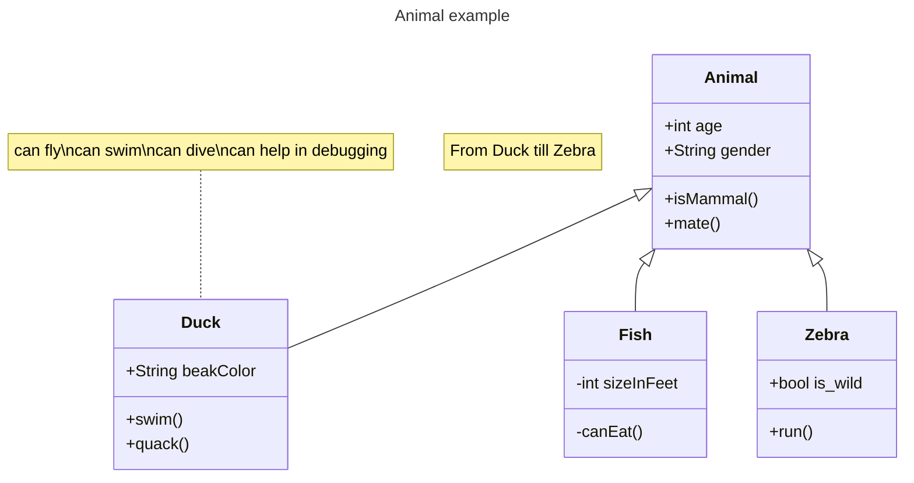

# UML类图

1. 基于mermaid的实现
    - https://mermaid.nodejs.cn/syntax/classDiagram.html

    - https://mermaid.js.org/syntax/classDiagram.html

2. UML类图的介绍基于千问大模型

# 1. mermaid使用

## 1.1 案例


## 1.2 使用

1. 基础

    ```
    classDiagram
        Animal <|-- Duck

        class Animal{
            +String gender
            +isMammal()   
        }

        class Duck{
            +String beakColor
            +swim()
            +quack()
        }  
    ```

2. 常见类的6种关系

    `[classA][Arrow][ClassB]`

    ```
    classDiagram
        classA <|-- classB  # 继承（泛化） Inheritance
        classM <|.. classN  # 实现 Realization
        classC *-- classD   # 组合 Composition
        classE o-- classF  # 聚合 Aggregation
        classG <-- classH  # 关联 Association
        classK <.. classL # 依赖 Dependency

        classK1 <.. classL1: Dependency  # 展示关系文字
    ```

    箭头效果图
    ```mermaid
    classDiagram
        direction TB
        A <|-- B  
        M <|.. N  
        C *-- D   
        E o-- F  
        G <-- H  
        K <.. L 
        classK1 <.. classL1: Dependency

        class A{ 继承 }
        class M{ 实现 }
        class C{ 组合 }
        class E{ 聚合 }
        class G{ 关联 }
        class K{ 依赖 }
    ```

3. 成员变量和成员函数的属性

    ```
        + Public
        - Private
        # Protected
        ~ Package/Internal
    ```

    效果图
    ```mermaid
        classDiagram
            class A{
                + Public
                - Private
                # Protected
                ~ Package/Internal
            }
    ```

# 2. 关系

## 2.1 继承 Inheritance
1. Son继承Father, 箭头指向Father

    ```mermaid
    classDiagram
        direction LR
        Father <|-- Son

        class Father{
            + Name
        }

        class Son{
            + Name
            + Age
        }
    ```

## 2.2 实现 Realization
1. 子类实现了父类的功能，指向父类

    Circle类实现了Drawable的draw方法

    ```python
    from abc import ABC, abstractmethod

    # 定义抽象基类（接口）
    class Drawable(ABC):
        @abstractmethod
        def draw(self):
            pass

    # Circle 类实现了 Drawable 接口
    class Circle(Drawable):
        def draw(self):
            print("Drawing a circle")
    ```

2. 样例

    ```mermaid
    classDiagram
        direction LR
        Drawable <|.. Circle

        class Drawable{
            + draw()
        }

        class Circle{
            + draw()
        }
    ```

## 2.3 组合 Composition

1. 一个类的对象作为另一个类的成员变量

    ```python
    class Engine:
        def __init__(self, name):
            self.name = name
        
        def start(self):
            print("Engine started.")

        def stop(self):
            print("Engine stopped.")


    class Car:
        def __init__(self, engine):
            self.engine = engine
        
        def start(self):
            print("Car starting...")
            self.engine.start()
        
        def stop(self):
            print("Car stopping...")
            self.engine.stop()
    ```

2. 样例

    ```mermaid
    classDiagram
        direction LR
        Car *-- Engine
        class Car{
            + engine
            + start()
            + stop()
        }

        class Engine{
            + name
            + start()
            + stop()
        }
    ```

## 2.4 聚合 Aggregation

1. 与“组合”的区别体现在生命周期上
    - 组合（contains-a）：被包含对象的生命期完全依赖于容器对象。**当容器对象被销毁时，被包含对象也会随之销毁。**
    - 聚合（has-a）：被包含对象的生命期不依赖于容器对象。**即使容器对象被销毁，被包含对象仍然可以存在。**

2. 样例
    ```mermaid
    classDiagram
        Department o-- Employee
    ```

## 2.5 关联 Association
### 2.5.1 概念

1. 与“组合”或“聚合”的区别，体现在“关联”中的两个类之间**不存在所有权关系**
    - 两个类之间可以是一对一，也可以是一对多的关系

    典型案例就是Student与Course
    ```python
    class Student:
        def __init__(self, name):
            self.name = name
            self.courses = []

        def register_course(self, course):
            if course not in self.courses:
                self.courses.append(course)
                course.enroll_student(self)

        def unregister_course(self, course):
            if course in self.courses:
                self.courses.remove(course)
                course.unenroll_student(self)

        def display_courses(self):
            print(f"{self.name} is enrolled in:")
            for course in self.courses:
                print(course.name)


    class Course:
        def __init__(self, name):
            self.name = name
            self.students = []

        def enroll_student(self, student):
            if student not in self.students:
                self.students.append(student)

        def unenroll_student(self, student):
            if student in self.students:
                self.students.remove(student)

        def display_students(self):
            print(f"Students enrolled in {self.name}:")
            for student in self.students:
                print(student.name)

    ```

2. 效果

    ```mermaid
    classDiagram
        Department -- Employee

    ```

### 2.5.2 导航性 Navigability

1. 导航性：使用箭头表示, 谁能访问谁
    - A --> B 表示A可以访问B

2. 若没有箭头，则表示可以双向访问
    - A -- B 表示A和B可以相互访问

### 2.5.3 多重性标注

1. 关联中，存在一对多，多对多的情况

    A (1) -- (*) B, 表示一个A对应多个B

2. 不同的基数选项是：
    - `1`: 只有 1 个

    - `*`: 许多

    - `0..1`: 零或一

    - `1..*`: 一个或多个

    - `n`: n个（其中 n>1）

    - `0..n`: 0 到 n（其中 n>1）

    - `1..n`: 1 到 n（其中 n>1）

3. mermaid中
    ```mermaid
    classDiagram
        direction LR
        Department "1" -- "*" Employee
    ```

## 2.6 依赖 Dependency

1. 依赖通常表示的是临时性的使用关系
    - 组合、聚合更接近于长期持有的关系

    因此，依赖通常以函数参数的形式体现

2. 依赖方 --> 被依赖方

3. 样例

    Person 依赖 Printer

    ```mermaid
    classDiagram

        direction LR
        
        class Person {
            - name
            + write_something(printer)
        }

        class Printer{
            + print()
        }


        Person ..> Printer

    ```