# 前言
《断墨寻径》是一个B站Up做的关于学习方法的探讨和分析，其分析的完整性和深度都是少见的。Up主本身也是西安电子的老师，所以整体的内容可信度较高。

这是他的视频连接：[【教育部产学】不良学习误区自我排查：掌握科学学习，考入理想学校](https://www.bilibili.com/video/BV1aS4y1X7eY)

如他所讲"该课程其实适合所有应试生，但课程是主要针对高中生的"。我在研究生即将毕业的时候看到这个视频，对其中的很多内容或深有同感或大受启发。因此做笔记来记录其重要内容。这篇博客，与其说是给别人看的，不如说是给自己看的；与其说是给自己以后看的，不如说是给现在加强记忆的。

<!--more-->

对他整体内容的评价：

- 整体概念与机器学习中的十分类似，恰巧我是研究深度学习的，因此有所了解。
- 他作为一个完整的学习过程分析，必然借用很多已有的成果。不必追根溯源，看初始提出原文怎么讲的。因此，我的笔记就以Up主所讲观念为主。
- Up主一人之力，难以完善，所以人家题目叫"不良学习误区自我排查"。我们也应这么用，有则改之无则加勉。

# 重现目标与泛化目标
学习任务分为两类：

- 记忆：重现信息。信息就是对某事物的具体描述。 
- 学习：泛化知识。知识是指对某类事物的抽象描述。学习比记忆，多在可泛化上，也就是可以应对从未出现的新情况。

 
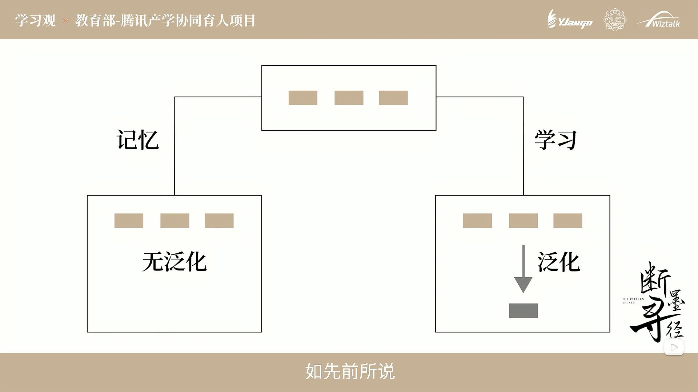 

 

# 指令学习和归纳学习
对于泛化学习目标，有两个学习方式。
指令学习，给你个概念，给你个说明书。学校常用，但大脑不擅长这种方式。

 
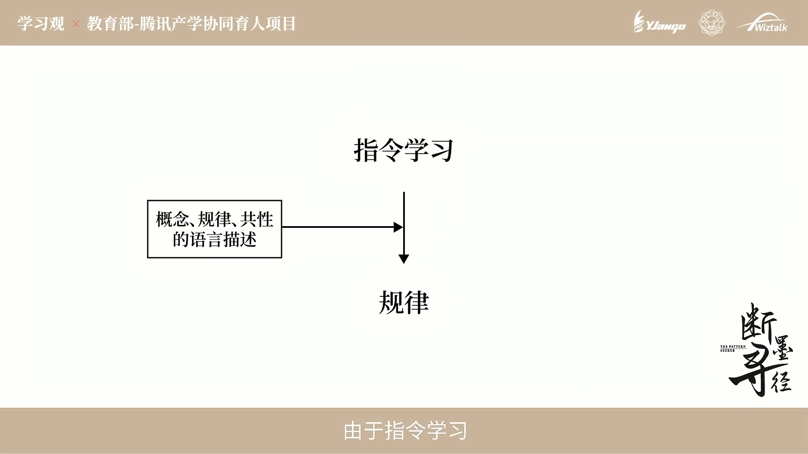 

 
归纳学习，直接研究案例，总结共性。在无意识的情况下，大脑自动总结归纳。大脑擅长。但容易受到案例的影响，比如案例偏激，总结出的规律就不具备普适性。

 
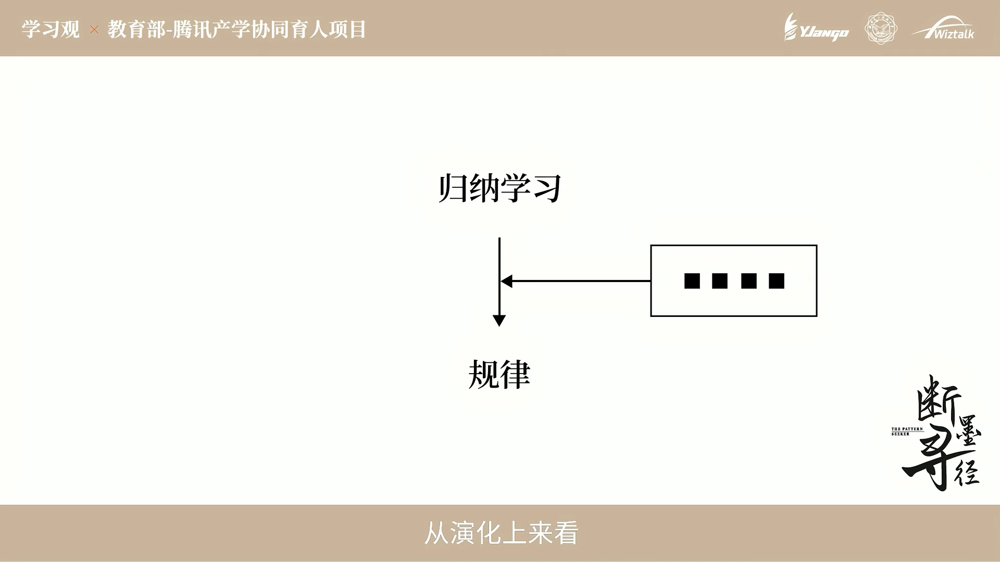 

 

最佳的学习模式应该是结合两者的模式。为什么？
- 那些概念和定义，以指令学习的方式，构建一个框架，可以确定大方向不至于跑偏。这相当于绘画的底稿。
- 多个实际的案例，以归纳学习的方式，填充内容，相当于上色。

 
 

 

# 归纳不足和以偏概全
这其实就是机器学习中的欠拟合和过拟合的概念。对于高中生而言，欠拟合就是做题少。过拟合就是做了一堆偏难怪，导致总结的规律没有通用性。

Up主建议双例学习法

 
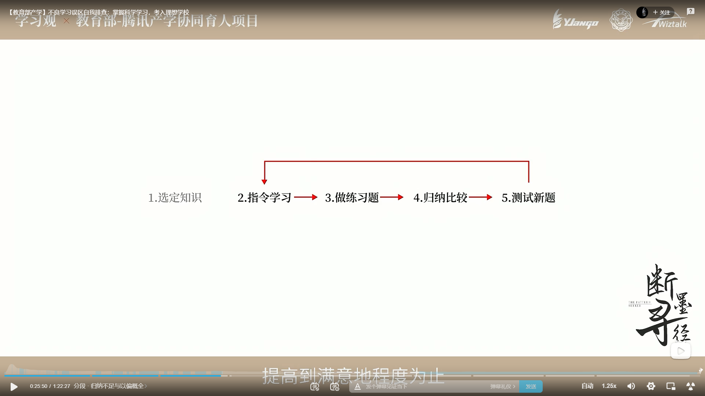 

 

# 可泛化性和有效范围
这主要是针对，网络学习的知识付费课程

1. 所讲知识本身，是否具有泛化能力？
2. 什么条件下，使用这个知识？限定条件也很重要！

# 有效指令与有效实例
有效实例是指带结果的实例，这相当于机器学习中有标签的监督学习。

有效描述（指令）是指，这个概念中设计的所有子概念，都已经清楚。

# 材料瓶颈和模型瓶颈
由材料瓶颈引起的泛化能力不能继续提升。从未见过的新情况越来越少，而可以得到的材料绝大部分都是已学习过的规律和模型。

 
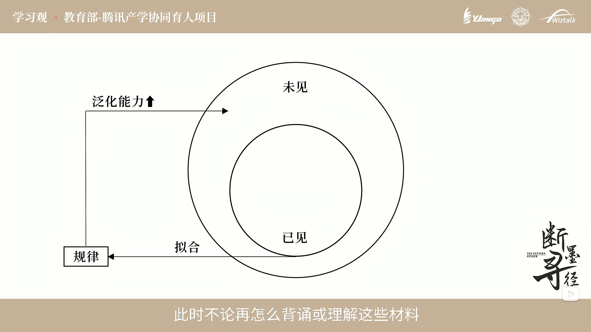 

 
另一种则是模型瓶颈，习惯某种已有的思路，但这种思路或者方案并不完善。而大脑会本能的拒绝新规律的进入。此时可用一个满足新规律但不满足旧规律的实例，来打破这种瓶颈，让大脑意识已有规律到还不完善。

 
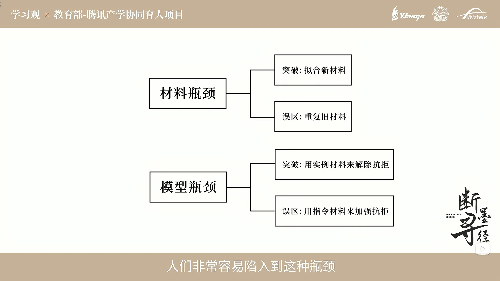 

 

# 知识的存储位置和存储过程
首先是两个误区，这恰恰是违反了知识的存储过程

 
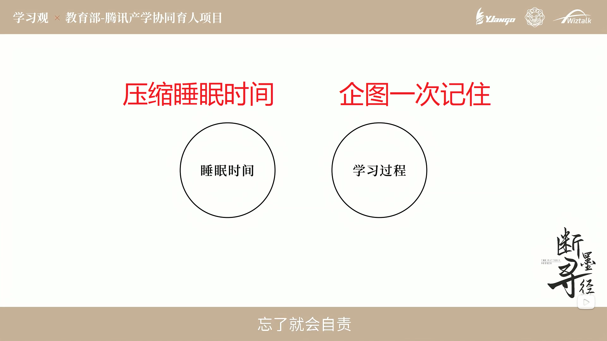 

 

## 存储位置
我理解一下Up的观念：
知识存储于神经细胞之间的连接，但这个连接并不是越多越好（婴儿的最多）。
学习实际上就是改变神经之间连接的过程。
（这真的和深度学习中的神经网络很相似）

 
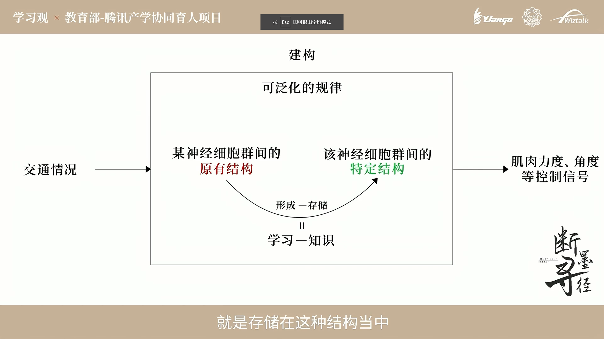 

 

## 存储过程
大脑根据完整的事例，可改变神经细胞之间的连接。
**而改变的时间，就在睡眠期间。**

 
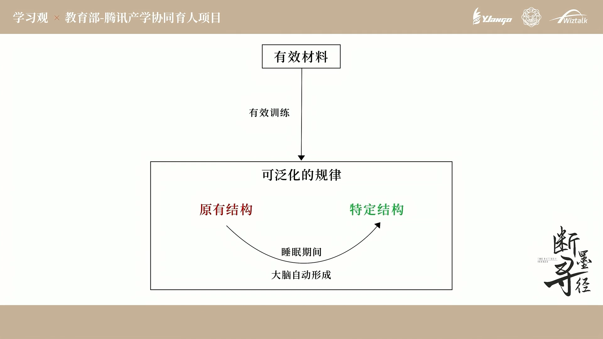 

 
大脑无法一次性就得到正确的连接，需要多次调整才可以。
（如果你观察过深度学习中的Loss曲线，深以为然。）

 
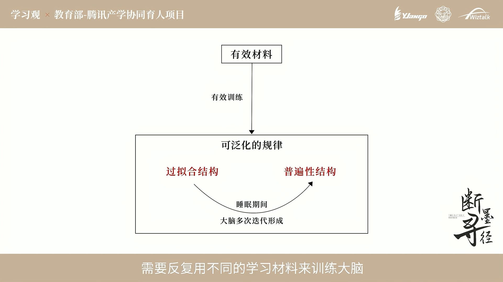 

 

# 有效训练与精细加工

想象和观察也能刺激大脑，但远不如自己实际执行一遍的的刺激程度。
有效训练是指自己实际执行并且有得到反馈答案的整体过程。相当于做完题看答案。

 
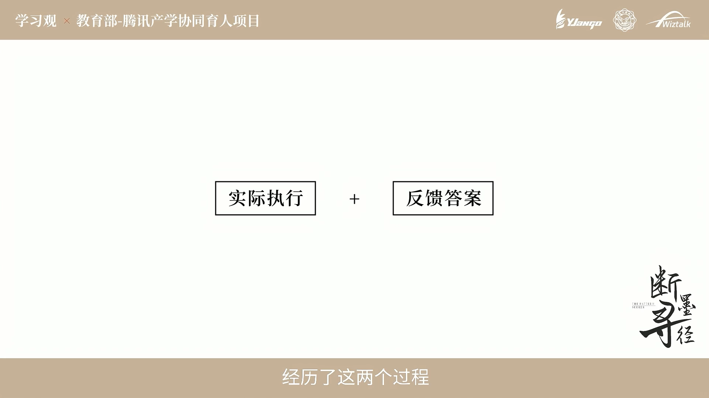 

 
指令性学习，比如只给一条概念怎么办？
你得自行根据定义扩充材料，进行思考。相当于把书读厚。

 
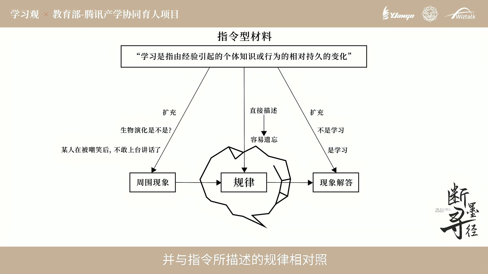 

 
同时针对指令性学习，和旧知识建立对比联系也很有帮助。
而把书读薄，是指大脑根据材料自动归纳出一般规律，并不是人为的对书本内容进行删减。

 
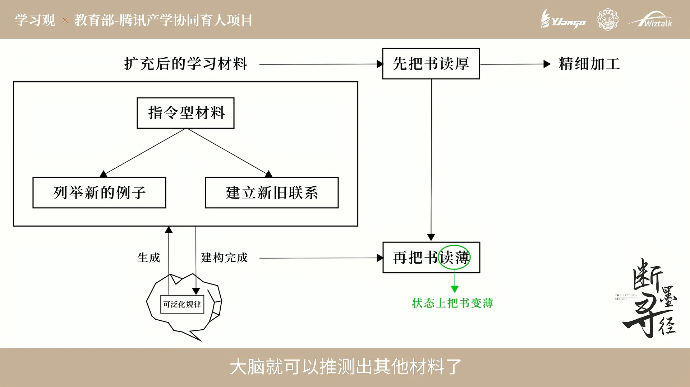 

 

# 新例预测和表述转换
大脑需要一个信号，停止调整，也需要一个动作来保持记忆，这个动作就是验证。

 
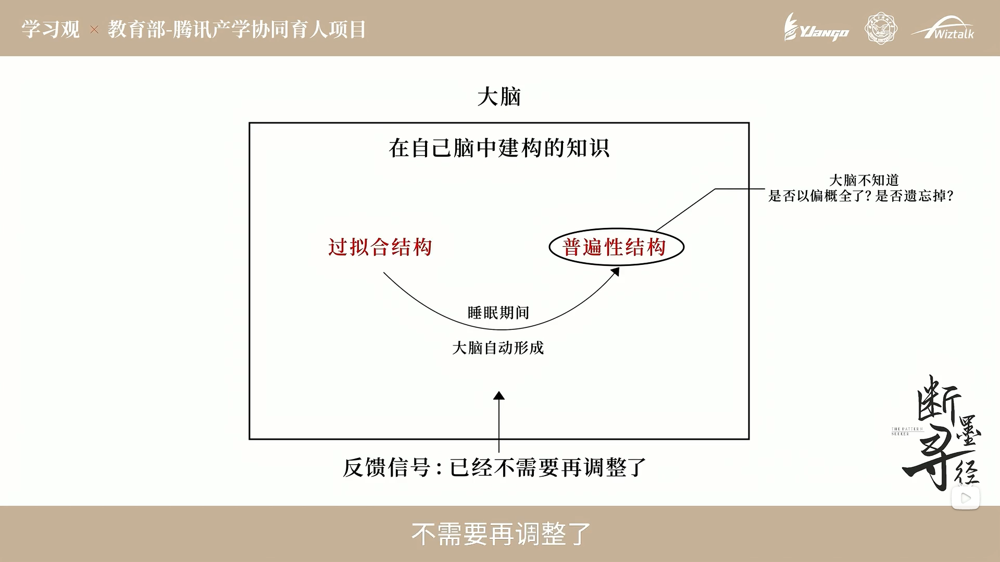 

 
这个验证，对于泛化学习目标来说，可以再做一些题。对于重现学习目标，可以用自己的话重新表述。

 
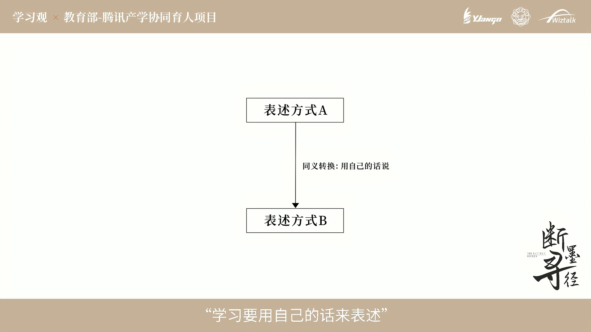 

 
而给别人讲题，则成功兼具了这两点。

 
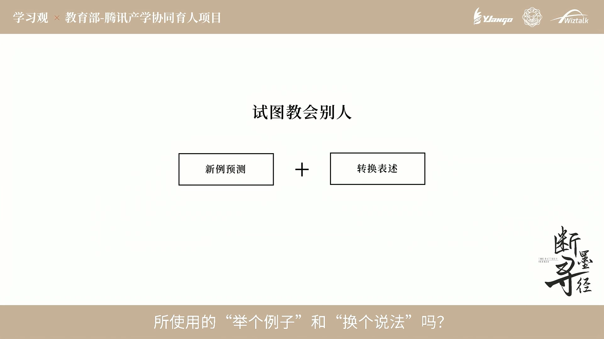 

 

# 整体框架

对于一个学习任务，需要明确的是这是需要理解的泛化任务，还是需要背诵的复现任务。
而对于泛化学习任务，Up主的整个系列的内容，可概括为这个框架。

 
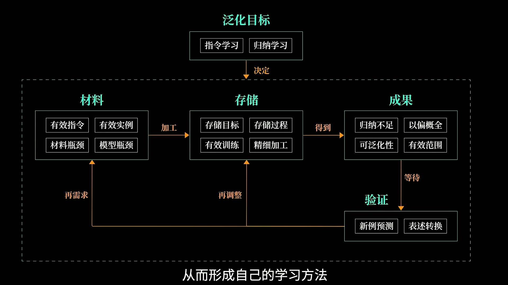 

 

# 总结
就我个人而言，这个视频中对于指令性学习和归纳性学习的分析和论断，让我眼前一亮。之前学习深度学习的相关知识，总会有些定义概念要看，但实际上也没什么用。有位老师针对这种情况说：“那些书本上的东西，看了没什么用，不看感觉有少点什么。”  我同意这个评论，而上面Up主的分析，让我搞懂了“少的”是什么。