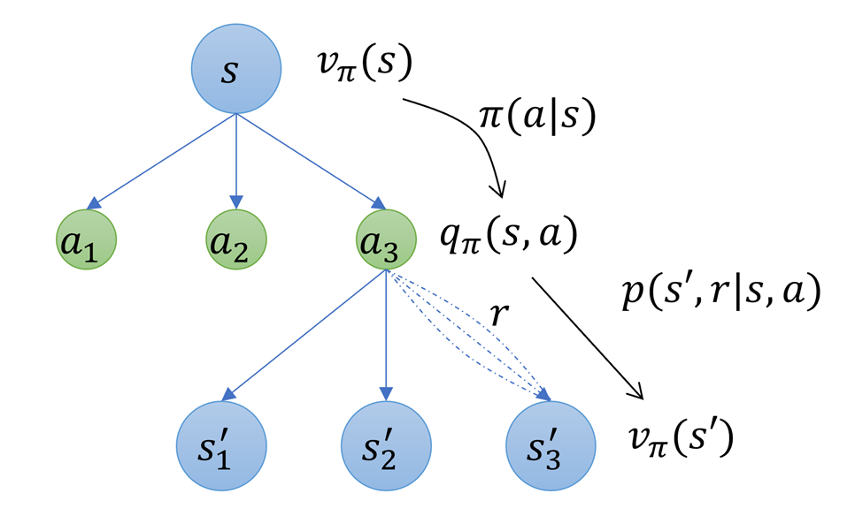
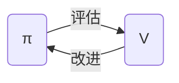

# 1. 资料

- 书籍：《强化学习 （第2版）》 Sutton
- 视频讲解：B站shuhuai008的白板推导https://www.bilibili.com/video/BV1RA411q7wt
- 答疑：Deepseek，Qwen


# 2. 多臂赌博机

## 2.1 模型构建与分析

1. 听上去简单但是实际模型很复杂的K臂赌博机

   - 有 $K$ 个拉杆，$t$ 时刻拉下一个杆后（执行动作$A_t$）获得一定的收益 $R_t$

     - 拉动不同的杆获得的收益是不同的，
     - 多次拉动同一个杆获得的收益也不同，但符合某种分布

   - 有$K$种候选动作，即 $|A_t| = K$

   - 每个动作 $A_t$ 执行后获得的收益 $R_t$，符合一定的概率分布（多次拉动同一个杆）但玩家不知道

     比如，拉动第一个杆$A_t = a_1$，获得的收益$R_t \sim N(\mu,1)$，

     - 该分布在拉动前就已经确定且不在变化，
     - 但玩家不知道这个具体的分布类型和参数

   - 每个动作的价值：执行这个动作的收益期望
     $$
     q_*(a) = E[ R_t | A_t = a ]
     $$
     很明显，$q_*(a)$在玩家执行动作前就已确定（是个定值）。在上一个例子中，$q_*(a_1)= \mu$

   - 玩家要想获得最大收益，就要根据历史记录估计$q_*(a)$，估计值记作 $Q_t(a)$

     

2. 对K臂赌博机的一轮试验

   - 从一个分布中（比如 $N(0,1)$ ）采样，确定每个动作的价值 $q_*(a)$
   - 玩家有$N$次（比如1000次）执行动作的机会，执行动作并获取收益

   每次动作的执行得到的样本$(A_t,R_t)$，都可以看做是独立同分布的

   

   多轮试验，就是将这个过程执行$M$次（比如2000次）

   每轮试验间，也可以看做是独立同分布的

   

3. 开发和试探

   - 开发（exploitation）：贪心的选择当前最高估值的动作
   - 试探（exploration）：不选择当前最高估值的动作

   从长远角度，试探更有利于总体收益的最大化。因为试探有利于对当前估值的改进。

   

4. $\varepsilon$-贪心策略：保证每个动作至少有$\varepsilon$的概率被选中

   - 贪心动作被选中的概率 = $1-\varepsilon + \frac{\varepsilon}{|A|}$
   - 非贪心动作被选中的概率 = $ \frac{\varepsilon}{|A|} $

   随训练步数增加，逐步减少$\varepsilon$是一个更好的选择：前期试探，后期开发

   

## 2.2 增量式实现

前n步对应的收益和，记为$Q_{n+1}$

从定义式可推导出增量式实现
$$
\begin{align*}
Q_{n+1} &\triangleq \frac{1}{n} \sum_{i=1}^n R_i    \\
		&=\frac{1}{n}[R_n + (n-1) \cdot \frac{1}{n-1}\sum_{i=1}^{n-1} R_i]  \\
		&= \frac{1}{n}[R_n + (n-1)Q_n]		\\
		&= Q_n + \frac{1}{n} [R_n - Q_n]

\end{align*}
$$
该增量式十分重要，在实际应用中，可以节约内存和运算时间
$$
新估计值 = 旧估计值 + 步长 \times [目标 - 旧估计值]
$$

## 2.3 非平稳问题

1. 针对非平稳过程

   - 非平稳：一个系统的统计特性（均值、方差等）随时间变化

   常见解决办法是在增量式更新中，使用固定步长
   $$
   Q_{n+1} \triangleq Q_n + \alpha[R_n - Q_n]
   $$

   - 此时相当于给靠近现在的值一个更大的权重，你现在越远权重越低
   - 初始值 $Q_0$ 是人为给定的，可以直接设为0，也可以根据经验设置一个值
     - 设置一个较大的初始值有助于在初期的试探

2. 如果步长不是常数 $\alpha$，是一个关于 $n$ 的函数 $\alpha_n$ ，即
   $$
   Q_{n+1} = Q_n + \alpha_n[R_n - Q_n]
   $$
   整理后，可得
   $$
   Q_{n+1} = Q_1 \cdot \prod_{i=1}^{n}(1-a_i) + \sum_{i=1}^n R_i \cdot a_i \prod_{k=1}^{n}(1-a_k)
   $$

3. 使用UCB上界去寻找最佳动作的方法也有助于综合考虑开发和试探两个过程。

   但没有实用方法使用这种方案

   


## 2.4 梯度上升算法

书上的推导过程信息虽然全面，但条理脉络不是特别清晰。

推导过程基于Deepseek，并按书中符号进行整理。

----
### 2.4.1 基础建模

1. **描述量**

   $\pi_t(a)$表示在 $t$ 时刻选择动作 $a$ 的概率，通过 softmax 函数表示：
   $$
   \pi_t(a) = \frac{e^{H_t(a)}}{\sum_{b=1}^K e^{H_t(b)}}
   $$
   其中，$ H_t(a) $是动作$ a $在时间$ t $的偏好值，$ H_t(a) $的取值范围没有要求。


2. **目标函数**

   目标是最大化**期望奖励**：
   $$
   \begin{align*}
   J(H) &= \mathbb{E}[R_t] \\
       &\xlongequal{全期望定理} \sum_{x=1}^K p(a) \cdot \mathbb{E}[R_t | A_t =x]   \\
       &=\sum_{x=1}^K \pi_t(x) \cdot q_*(x) \\
   \end{align*}
   $$
   其中：

   - $ q_*(x) $是动作$ x $的期望奖励。

   - $ \pi_t(x) $是动作$ x $的选择概率。

     

3. **随机梯度上升**

   为了最大化$ J(H) $，我们使用随机梯度上升更新偏好$ H_t(a) $：
   $$
   H_{t+1}(a) = H_t(a) + \alpha \cdot \frac{\partial J(H)}{\partial H_t(a)}
   $$
   其中：

   - $ \alpha $是学习率。
   - $ \frac{\partial J(H)}{\partial H_t(a)} $是目标函数$ J(H) $对偏好$ H_t(a) $的梯度。

----
### 2.4.2 梯度计算

4. **梯度推导**

   展开$ J(H) $：
   $$
   J(H) = \sum_{x=1}^K \pi_t(x) \cdot q_*(x)
   $$
   对$ H_t(a) $求偏导：
   $$
   \frac{\partial J(H)}{\partial H_t(a)} = \sum_{x=1}^K q_*(x) \cdot \frac{\partial \pi_t(x)}{\partial H_t(a)}
   $$

   根据 softmax 函数的性质：
   $$
   \frac{\partial \pi_t(x)}{\partial H_t(a)} = \pi_t(x) \cdot (\mathbb{I}_{a=x} - \pi_t(a))
   $$
   其中$ \mathbb{I}_{a=x} $是指示函数，当$ a = x $时为 1，否则为 0。

   因此：
   $$
   \frac{\partial J(H)}{\partial H_t(a)} = \sum_{x=1}^K q_*(x) \cdot \pi_t(x) \cdot (\mathbb{I}_{a=x} - \pi_t(a))
   $$

5. **引入单次采样**

   由于 $q_*(x)$ 未知，我们通过采样动作 $A_t$ 来近似期望值。假设在时间 $t$ 选择了动作 $A_t$，则：
   $$
   \frac{\partial J(H)}{\partial H_t(a)} \approx R_t \cdot (\mathbb{I}_{a=A_t} - \pi_t(a))
   $$
   **单次采样的近似**：这里 $\pi_t(x)$ 的作用体现在采样过程中：根据  $\pi_t(x)$选择动作 $A_t$，然后用 $R_t$ 来近似 $q_*(x)$。

   

6. **引入基线**

   基线 $\bar{R}_t $是一个与动作无关的标量值（通常是历史奖励的平均值）。它的作用是**中心化奖励**，使得更新规则更加稳定。

   为了减少方差，加速收敛，引入基线$ \bar{R}_t $（通常是历史奖励的平均值）：
   $$
   \frac{\partial J(H)}{\partial H_t(a)} \approx (R_t - \bar{R}_t) \cdot (\mathbb{I}_{a=A_t} - \pi_t(a))
   $$

   **为什么能凭空引入基线**（有待深入探索）
   
   - 数学上看，因为不影响无偏性
     $$
     \begin{align*}
     \mathbb{E}\left[ (R_t - \bar{R}_t) \cdot (\mathbb{I}_{a=A_t} - \pi_t(a)) \right] &= \mathbb{E}\left[ R_t \cdot (\mathbb{I}_{a=A_t} - \pi_t(a)) \right] - \mathbb{E}\left[ \bar{R}_t \cdot (\mathbb{I}_{a=A_t} - \pi_t(a)) \right]  \\
     	&= \mathbb{E}\left[ R_t \cdot (\mathbb{I}_{a=A_t} - \pi_t(a)) \right] - \bar{R}_t \cdot \mathbb{E}\left[ \mathbb{I}_{a=A_t} - \pi_t(a) \right]   \\
     	&= \mathbb{E}\left[ R_t \cdot (\mathbb{I}_{a=A_t} - \pi_t(a)) \right] - \bar{R}_t \cdot[{\pi_t(a)} - {\pi_t(a)} ]    \\
     	& = \mathbb{E}\left[ R_t \cdot (\mathbb{I}_{a=A_t} - \pi_t(a)) \right]
     \end{align*}
     $$
----

### 2.4.3 偏好更新规则

将梯度代入随机梯度上升更新规则，得到偏好更新公式：
$$
H_{t+1}(a) = H_t(a) + \alpha \cdot (R_t - \bar{R}_t) \cdot (\mathbb{I}_{a=A_t} - \pi_t(a))
$$

直观理解：
- 如果$ R_t > \bar{R}_t $，说明当前动作表现较好，偏好$ H_t(a) $增加。
- 如果$ R_t < \bar{R}_t $，说明当前动作表现较差，偏好$ H_t(a) $减少。
- 基线$ \bar{R}_t $减少了更新规则的方差，加速算法收敛。


## 2.5 关联搜索

- 既涉及搜索最优动作

- 又将这些动作表现最优时的情景关联起来

  

# 3.有限马尔可夫决策过程

## 3.1 MDP的建模

1. MDP：Markov Decision Process

   智能体根据当前环境状态$S_0$，选择动作$A_0$执行，得到收益$R_1$，环境状态更新为$S_1$
   $$
   S_0,  A_0,  R_1,  S_1,  A_1,  R_2,  S_2,  A_2,  ...
   $$

   有限MDP是指$S,A,R$的可能取值是有限个

   注意：该书中当前时刻执行动作$A_0$，是在下一时刻获得的收益$R_1$

2. MDP的动态特性：
   
   在当前环境$s$和智能体执行动作$a$的情况下，环境变为$s'$并且智能体得到收益$r$的概率
   $$
   p( s',   r |s,  a) \triangleq \text{Pr}\{S_{t+1} = s',R_{t+1} = r | S_t=s, A_t =a\}
   $$
   
   - 该公式说明$S_{t+1}$和$R_{t+1}$，仅取决于上一个状态$S_t$和动作$A_t$，与更早的动作和状态无关。（马尔可夫性）
   
   - 一个变量的求和
     $$
     p(r |s,  a) = \sum_{s'} p( s',   r |s,  a)
     $$
     
   - 从一个条件$(s,a)$出发，所能达到的全部情况的概率和为1
   
   $$
   \sum_{s'}\sum_{r} p( s',   r |s,  a) = 1
   $$
   
   
   
3. 在根据文字描述对某个有限MDP进行建模时，强烈建议：

   - 手写出全部的$(s,a)$
   - 确定由当前的$(s,a)$能到达哪些$(s',r)$，即列出四元组$(s,a,s',r)$，再列出概率$p( s',   r |s,  a)$
   - 并保证$\sum_{s'}\sum_{r} p( s',   r |s,  a) = 1$

   注意：不是所有MDP都有终止态


## 3.2 回报

回报：未来收益之和
$$
G_t \triangleq R_{t+1} + R_{t+2} + ... + R_{T}
$$
其中，$T$是终止时间

我们通常加入一个折扣$\gamma$
$$
\begin{align*}
G_t &\triangleq R_{t+1} + \gamma  R_{t+2} +  \gamma^{2}  R_{t+2} + ... \\
	& = \sum_{k=0}^{\infty} \gamma^{k}  R_{t+k+1}
\end{align*}
$$
考虑一下递归公式
$$
\begin{align*}
G_t &\triangleq R_{t+1} + \gamma  R_{t+2} +  \gamma^{2}  R_{t+2} + ... \\
	& = R_{t+1} + \gamma ( R_{t+2} +  \gamma R_{t+2} + ...) \\
	& = R_{t+1} + \gamma G_{t+1}
\end{align*}
$$
此公式很重要，用于反向递推。在程序实现中，就是先计算$G_{t+n}$，然后根据该公式逐步迭代得到$G_t$的


## 3.3 策略与价值函数

### 3.3.1 策略$\pi$

$\pi(a|s)$，在当前环境为$s$的情况下，智能体选择动作$a$的概率

- 小计算（练习3.11，完全从公式推导的角度）：使用$p( s',   r |s,  a)$和$\pi(a|s)$表示$E_\pi[R_t|St=s]$
  $$
  \begin{align*}
  E_\pi[R_t|St=s] &\triangleq \sum_{r} r \cdot p(r|s)  \\
  				&= \sum_{r} r \sum_{s',a}p( s',   r,  a |s) \\
  	
  \end{align*}
  $$
  而
  $$
  \begin{align*}
  p( s',   r,  a |s) &= \frac{p( s',   r,  a,  s)}{p(s)}  \\
  								& = \frac{p( s',   r|  a,  s)p(a, s)}{p(s)} \\
  								& = \pi(a|s) p( s',   r|  a,  s)            \\	
  \end{align*}
  $$
  带入得
  $$
  E_\pi[R_t|St=s] = \sum_{r} r \sum_{s',a}\pi(a|s) p( s',   r|  a,  s)
  $$


### 3.3.2 价值函数

- 状态价值函数$v_\pi(s)$：智能体在状态$s$时，根据策略$\pi$进行决策，获得的期望回报
  $$
  v_\pi(s) \triangleq E_\pi[G_t|S_t = s]
  $$

- 动作价值函数$q_\pi(s,a)$：智能体在状态$s$并根据策略$\pi$执行动作$a$，获得的期望回报
  $$
  q_\pi(s) \triangleq E_\pi[G_t|S_t = s, A_t =a]
  $$

## 3.4 回溯图和贝尔曼方程

### 3.4.1 回溯图



- 当状态为$s$的时候，有3个动作（$a_1,a_2,a_3$）可以选择，选择某一个动作的概率为$\pi(a|s)$

- 状态为$s$，此时状态价值函数为$v_\pi(s)$

- 当状态为$s$，并且选择了动作$a_3$后，此时动作价值函数为$q_\pi(s,a)$

- 执行动作$a_3$后，获得的收益为$r$，虚线表示收益的多种可能性

- 当状态到达$s’$时，对应的状态价值函数为$v_\pi(s')$

  

两个价值函数的关系为：

- 根据回溯图，可得出

    $$
    v_\pi(s) = \sum_{a}\pi(a|s) \cdot q_\pi(s,a)
    $$
- 先展开$G_t$，然后利用回溯图（最后一个等号处）可得出
    $$
    \begin{align*}
    q_\pi(s) &\triangleq E_\pi[G_t|S_t = s, A_t =a] \\
         & = E_\pi[R_{t+1} + \gamma G_{t+1} | s, a] \\
         & = \sum_{r,s'}[r + \gamma v_\pi(s')] \cdot p(s', r| s, a)
    \end{align*}
    $$

注：两个关系，更接近从含义（回溯图）直接得到，而不是从概率公式推导。

### 3.4.2 贝尔曼方程

可根据两个价值函数之间的关系（事实上就是回溯图）相互导入得出
$$
\begin{align*}
v_\pi(s) & = \sum_{a}\pi(a|s) \cdot \sum_{s', r} p(s', r| s, a) \cdot [r + \gamma v_\pi(s')] \\
q_\pi(s,a) &= \sum_{s', r} p(s', r| s, a) \cdot [r + \gamma \sum_{a'}\pi(a|s') \cdot q_\pi(s',a')]
\end{align*}
$$

后续全部工作几乎都围绕在贝尔曼方程的求解问题上


## 3.5 最优策略

1. 最优策略的定义

   - 两个策略的好坏对比：对于 $\forall s \in S$，有$v_{\pi}(s) \geq v_{\pi'}(s) $，则$\pi > \pi' $（$\pi$ 比 $\pi’$ 好）

   - 总会至少有一个策略，不差于其他策略：这个策略称为最优策略$\pi_*$

     - $\pi_*$可以是多个

2. 最优价值函数
$$
  \begin{align*}
  v_*(s) & \triangleq \max_{\pi} v_\pi(s)    \\
  q_*(s,a) & \triangleq \max_{\pi} q_\pi(s,a)
  \end{align*}
$$

3. 最优价值函数关系

   由于
   $$
   v_\pi(s) = \sum_{a}\pi(a|s) \cdot q_\pi(s,a)
   $$
   相当于$v_\pi(s)$是$q_\pi(s,a)$是按照策略$\pi$的期望。

   而当我们已知最优策略$\pi_{*}$后，可以让智能体直接选择使$q_\pi(s,a)$最大的动作。因此，
   $$
   v_* = \max_a q_*(s,a)
   $$
   根据
   $$
   q_\pi(s,a) = \sum_{r,s'}[r + \gamma v_\pi(s')] \cdot p(s', r| s, a)
   $$
   得到
   $$
   q_*(s,a) = \sum_{r,s'}[r + \gamma v_*(s')] \cdot p(s', r| s, a)
   $$
   根据这两个关系，可以求得贝尔曼最优方程组，求解得$q_*$


4. 根据$q_*(s,a)$确定当前的状态下的最优动作（即获取最优策略）

    - 找到当前状态下所有可执行的动作，然后
      $$
      a_* = \mathop{\arg\max}_{a} \enspace q_*(s,a)
      $$

    如果只有$v_*(s)$，先根据公式获得$q_*(s,a)$


# 4. 动态规划

1. 此处动态规划（Dynamic Programming）的对象：有限MDP，并且动态特性 $p(s', r | s, a)$ 已知

   注：

   - 使用 $v_\pi(s)$ 或 $q_\pi(s,a)$进行迭代都能得到最优策略，为书写简便后续以$v_\pi(s)$为主。
   - 但实际使用中，应以 $q_\pi(s,a)$ 为主，因为根据$q_\pi(s,a)$可直接得到策略$a_* = \mathop{\arg\max}_{a} \enspace q_*(s,a)$

2. 整体思路

   通过策略迭代的方式进行：

   - 策略评估(E)：先根据当前策略，评估出当前的价值函数。
   - 策略改进(I)：根据当前的价值函数，得到一个优化的策略

   $$
   (\pi_0, v_0) \xrightarrow{E}  v_{\pi_0} \xrightarrow{I} \pi_1 \xrightarrow{E}  v_{\pi_1} \xrightarrow{I} \pi_2 \xrightarrow{E}  v_{\pi_2} \xrightarrow[]{} ...\xrightarrow{I} \pi_* \xrightarrow{E}  v_{*}
   $$

   初值的选取问题：（在没有任何先验知识的情况下）

   - 初始策略可以选择均匀分布的随机策略：在任何状态下，选择任何一个动作的概率都相同

   - 初始价值可以选择任何值，通常选择0
     - 终止态的初始值必须是0，否则策略评估的迭代不成立（理由可见下文“策略评估的收敛”）
     
       


## 4.1 策略评估

1. 策略评估：

   **将贝尔曼价值函数转化成近似逼近理想价值函数的递归更新公式**

   - 对于$v_\pi(s)$
     $$
     v_\pi(s) = \sum_{a}\pi(a|s)  \sum_{r,s'}[r + \gamma v_\pi(s')] \cdot p(s', r| s, a)
     $$
     转化成
     $$
     v_{k+1}(s) = \sum_{a}\pi(a|s)  \sum_{r,s'}[r + \gamma v_{k}(s')] \cdot p(s', r| s, a)
     $$
     
   - 对于$q_\pi(s,a)$，则为
     $$
     q_{k+1}(s,a) = \sum_{s',r} p(s', r| s, a) [r + \gamma \sum_{a'}\pi(a'|s') \cdot q_k(s',a') ]
     $$

2. 策略评估的收敛

   - 只要$\gamma <1$或者任何状态在下$\pi$都达到终止态，那么$v_\pi$唯一存在

   - 在$v_\pi$存在的情况下，$k \rightarrow \infty$时，$v_\infty(s) \rightarrow v_\pi(s)$

   

   关于$v_0$为什么要将终止态设为0，以下是个人理解

   - 按照书中（第3.4节 分幕式和持续性任务的统一表示方法），应该把终止态看做一个特殊的吸收状态的入口，即它只会转移到自己并且产生零收益。

   - 因此，$G_t$ 只统计到进入终止态之前的 $r$ 即可（之后的 $r$ 全是0），也就是关于$G_t$ 的计算只考虑到进入到终止态的时刻即可。

   - 而，贝尔曼函数中从 $v_\pi(s)$ 到 $v_\pi(s')$，本身就是向后再执行一步的意思。

   - 如果在 $k=n$ 时 $v_k$已经收敛，在这个终止态零收益下，$v_k$、$v_{k+1}$、...、$v_{\infty}$才是相等的。


## 4.2 策略改进

1. 策略改进定理

   想象一种情况：当在状态 $s$ 的时候， 已知按照现有策略的状态价值函数$v_\pi(s)$

   - 按照现有策略 $\pi$ 选出的动作是 $a$
   - 构建了另一种策略$\pi'$：当前执行另一种动作$a'$，然后继续按当前策略$\pi$执行。当前对应的动作价值函数是$q_\pi(s,a') = q_\pi(s, \pi'(s))$

   我们有可能惊讶的发现，$q_\pi(s, \pi'(s)) ≥ v_\pi(s)$ 

   

   当$\forall s$，都有 $q_\pi(s, \pi'(s)) ≥ v_\pi(s)$ 时，我们称 $\pi'$ 比 $\pi$ 更好

   粗略的理解：根据第3.6节 最优策略和最优价值函数，$v_{\pi'}(s) = \max q_\pi(s, \pi'(s)) ≥ v_\pi(s)$，已经符合对策略好坏的定义。


2. 策略改进：如何根据价值函数找到更好的策略
   $$
   \begin{align*}
   \pi'(s) &\triangleq  \mathop{\arg\max}_{a} \enspace q_*(s,a)     \\
   		&=\mathop{\arg\max}_{a} \sum_{s', r}[r + \gamma v_\pi(s')] \cdot p(s', r| s, a)
   \end{align*}
   $$
   注，其实这个式子不太严谨，严谨的写法应该 $a_* = \mathop{\arg\max}_{a} \enspace q_*(s,a)$，理解其中含义即可。

   

   这里体现了”**单步搜索**“的思想：在下一步贪心地选择最优动作。

   但特别注意，这里是对**全部状态**都进行单步搜索，才更新一次策略。


## 4.3 策略迭代

------

**输入**

- 状态空间 $\mathcal{S}$，动作空间 $\mathcal{A}$，动态特性 $p(s',r |s, a)$，折扣因子 $\gamma$，收敛阈值 $\epsilon$

**输出**

- 最优策略 $\pi_*$

------

1. **初始化**:
   
   - 随机初始化策略 $\pi(s)$ 和价值函数 $v_\pi(s)$，对所有 $s \in \mathcal{S}$。

   - 设置策略稳定标志 $\text{policy\_stable} \gets \text{False}$。
   
2. **策略迭代 (Policy Iteration)**:
   - **While** $\text{policy\_stable} = \text{False}$:
     1. **策略评估 (Policy Evaluation)**:
        - **Repeat**:
           - $\Delta \gets 0$
           - **For** 每个状态 $s \in \mathcal{S}$:
             - $v_{k+1}(s) \gets \sum_{a} \pi(a|s) \sum_{s',r} p(s',r |s, a) [r + \gamma v_k(s')]$
             - $\Delta \gets \max(\Delta, |v_{k+1}(s) - v_k(s)|)$
        - **Until** $\Delta < \epsilon$
        - $v_{\pi}(s) \gets v_{k+1}(s) $
     2. **策略改进 (Policy Improvement)**:
        - $\text{policy\_stable} \gets \text{True}$
        - **For** 每个状态 $s \in \mathcal{S}$:
           - $\pi'(s) \gets \mathop{\arg\max}_{a} \sum_{s', r}[r + \gamma v_\pi(s')] \cdot p(s', r| s, a)$
           - **If** $\pi(s) \neq \pi'(s)$:
             - $\text{policy\_stable} \gets \text{False}$
   
3. **返回**:
   - 最优策略 $\pi^* \gets \pi$   

------

注：为了更直观理解其中思想，此处省略了 $v_\pi(s)$ 和 $\pi$，在迭代时的存储问题。实际上只需存储两个值，而不是k+1个值。以$v_{k+1}(s)$和$v_{k}(s)$为例

- $v_{old} \gets v_{new}$
- $v_{new} \gets f(v_{new})$ 
- 计算$|v_{new} - v_{old}|$


## 4.4 策略迭代的演进

$$
策略迭代 \xrightarrow{截断策略评估} 价值迭代 \xrightarrow{部分状态更新} 异步价值迭代
$$
1. 截断策略评估

   策略迭代（外循环）包含策略评估（内循环）和策略改进。而策略评估理论上是$v_\infty(s) \rightarrow v_\pi(s)$  ($k \rightarrow \infty$)，过于耗时。

   之前是等待$ v_k(s)$ 不变才策略评估（内循环）结束，截断策略评估是提前结束。


2. 价值迭代
   $$
   \begin{align*}
   v_{k+1}(s) &\triangleq  \max q_k(s,a)     \\
     &=\max \sum_{s', r}[r + \gamma v_k(s')] \cdot p(s', r| s, a)
    \end{align*}
   $$
   相当于将策略改进(max) 融合到策略评估（=）中，其中也不再显式的包含对策略$\pi$的估计。

   从回溯图上看

      - 完整的策略评估 $v_{k+1}(s) = \sum_{a} \pi(a|s) \sum_{s',r} p(s',r |s, a) [r + \gamma v_k(s')]$ 是先经过 $\pi(a|s)$ 再经过 $p(s',r |s, a)$ 走了完整的”一步“。
      - 价值迭代，跳过了 $\pi(a|s)$，相当于走了”半步“

      


3. 异步价值迭代

   在策略评估中采用单步探索，是针对全部状态的。现在只针对部分状态，进行价值函数更新。


4. **无论哪种迭代，均会收敛到最佳价值函数（或最佳策略）。**


5. 价值迭代算法

   ----

   **输入**

   - 状态空间 $\mathcal{S}$，动作空间 $\mathcal{A}$，动态特性 $p(s',r |s, a)$，折扣因子 $\gamma$，收敛阈值 $\epsilon$

   **输出**

   - 最优价值函数 $V_*$，最优策略 $\pi_*$

   ----

   1. **初始化**:

      - 对所有状态 $s \in \mathcal{S}$，初始化价值函数 $V(s)$。
      - 设置价值函数变化量 $\Delta \gets \infty$。

   2. **价值迭代**:
      - **While** $\Delta \geq \epsilon$:
        - $\Delta \gets 0$
        - **For** 每个状态 $s \in \mathcal{S}$:
             $v \gets V(s)$
             $V(s) \gets \max_a \sum_{s'} P(s'|s, a) [R(s, a, s') + \gamma V(s')]$
             $\Delta \gets \max(\Delta, |v - V(s)|)$

   3. **提取最优策略**:
      - **For** 每个状态 $s \in \mathcal{S}$:
        - $\pi^*(s) \gets \arg\max_a \sum_{s'} P(s'|s, a) [R(s, a, s') + \gamma V(s')]$

   4. **返回**:
      - 最优价值函数 $V^* \gets V$
      - 最优策略 $\pi^*$

   ----


## 4.5 广义策略迭代

广义策略迭代（Generalized Policy Iteration）

将强化学习的方法看成，策略评估和策略改进两个过程的循环。




# 5. 蒙特卡洛方法

## 5.1 MC预测


1. 此处以分幕式任务进行考虑
   - 即便是连续的一幕，也将其分成若干个幕
   - 价值估计和策略改进在幕结束之后才进行

2. 使用蒙特卡洛方法估计状态价值$v(s)$的核心思路：
   - 对样本观察，计算经过状态$s$的回报$G$的均值
   - 随样本量的加大，$\bar G$ 将收敛于$v(s)$

3. 首次访问 和 每次访问

   一幕中，状态$s$可能出现多次

   - 首次访问

     - 在每一幕中，只考虑状态$s$的第一次出现时对应的$G$。

     - 然后对所有幕中记录的$G$，求平均，就是$v(s)$的估计值

   - 每次访问

     - 在一幕中，对状态$s$出现时的$G$，求平均
     - 然后再对每幕中求平均，作为$v(s)$的估计值

   随访问次数的增加，两种方法均会收敛到$v(s)$

   

4. 首次访问型MC预测算法流程

   ----

   **输入**

   - 策略 $\pi$

   **输出**

   - 价值函数 $v_\pi(s)$的估计值$V$

   ----

   1. **初始化**：
      - 对于所有状态 $ s \in S $，初始化值函数 $ V(s) $ 为任意值（通常为0）。
      - 对于所有状态 $ s \in S $，初始化一个空的回报列表 $ Returns(s) $。

   2. **生成 episode**：
      - 使用策略 $ \pi $ 生成一个 episode：$ S_0, A_0, R_1, S_1, A_1, R_2, \dots, S_{T-1}, A_{T-1}, R_T, S_T $。

   3. **计算回报**：
      - 初始化回报 $ G = 0 $。
      - 对于 episode 中的每一步 $ t = T-1, T-2, \dots, 0 $：
        - 计算回报 $ G = \gamma G + R_{t+1} $，其中 $ \gamma $ 是折扣因子。
        - （判断条件）如果 $ S_t $ 在 episode 中首次出现：
          - 将 $ G $ 添加到 $ Returns(S_t) $ 中。
          - 更新值函数 $ V(S_t) $ 为 $ Returns(S_t) $ 的平均值。

   4. **重复**：
      - 重复步骤2和步骤3，直到值函数 $ V(s) $ 收敛。

   ----

   注意：

   - 计算 $G$ 的时候是从每一幕的末尾开始的，因此"首次访问"的状态$s$，实际上是每条轨迹中的最后一次出现
   - 对于每次访问算法，仅需要去掉判断条件
   - 对于首次访问，平均的只是幕间的$G$；对于每次访问，平均的是幕间和幕内的


5. 蒙特卡洛方法一个重要的特点：对一个状态的估计，不依赖于对其他状态的估计值

   

## 5.2 MC控制

对动作价值$q(s,a)$的估计有一个问题，在给定策略 $\pi$ 的前提下，有些状态动作对永远不会被选中。此时引出：

- 试探性假设：保证所有的状态动作对都有非零的概率作为一幕的起点

对广义策略迭代而言，一个假设（暂且记为无限样本假设）是：

- 可观测到无限多的样本序列


### 5.2.1 蒙特卡洛ES算法

1. 避免无限样本假设的方法：

   - 不再要求策略改进前完成策略评估
   - 而是在单个状态中交替进行策略改进和评估

2. 由此引出基于试探性假设的蒙特卡洛算法

   ----

   **输出**

   - 最优化策略 $\pi_*$

   ----

   1. **初始化**：
      - 对于所有状态 $ s \in S $ 和动作 $ a \in A(s) $，初始化动作值函数 $ Q(s, a) $ 为任意值（通常为0）。
      - 对于所有状态 $ s \in S $ 和动作 $ a \in A(s) $，初始化一个空的回报列表 $ Returns(s, a) $。
      - 初始化策略 $ \pi $ 为任意策略（如随机策略）。

   2. **生成 episode**：
      - 选择初始状态 $ S_0 $ 和初始动作 $ A_0 $，确保每个状态-动作对都有非零概率被选中（试探性出发）。
      - 使用策略 $ \pi $ 生成一个 episode：$ S_0, A_0, R_1, S_1, A_1, R_2, \dots, S_{T-1}, A_{T-1}, R_T, S_T $。

   3. **计算回报**：
      - 初始化回报 $ G = 0 $。
      - 对于 episode 中的每一步 $ t = T-1, T-2, \dots, 0 $：
        - 计算回报 $ G = \gamma G + R_{t+1} $，其中 $ \gamma $ 是折扣因子。
        - 如果 $ (S_t, A_t) $ 在 episode 中首次出现：
          - 将 $ G $ 添加到 $ Returns(S_t, A_t) $ 中。
          - 更新动作值函数 $ Q(S_t, A_t) $ 为 $ Returns(S_t, A_t) $ 的平均值。
          - 更新策略 $ \pi(S_t) $ 为贪心策略：$ \pi(S_t) = \arg\max_{a} Q(S_t, a) $。

   4. **重复**：
      - 重复步骤2和步骤3，直到动作值函数 $ Q(s, a) $ 和策略 $ \pi $ 收敛。

   ----

   注：在更新 $Q(S_t, A_t)$ 时，可以使用增量更新式 $Q_{n+1} = Q_n + \frac{1}{n}[G_n - Q_n] $, 用来节约内存


### 5.2.2 同轨&离轨

1. 如何避免试探性假设？那只能让智能体不断地选择所有可能的动作。

   两个策略：

   - 目标策略 $\pi$：实际执行时的策略，需要迭代成最优策略
   - 行动策略 $b$：用于采样的策略

   避免试探性假设的方法，由此分为

   - 同轨：行动策略和目标策略相同
   - 离轨：行动策略和目标策略不同


#### 5.2.2.1 同轨策略的首次访问算法

采用软性策略，比如 $\varepsilon$-贪心策略：

- 每个动作都有$ \frac{\varepsilon}{|A(s)|}$ 的概率被选中

因此，只需将基于试探性假设的蒙特卡洛算法中的策略更新，由
$$
   \pi(S_t) = \arg\max_{a} Q(S_t, a)
$$
变为
$$
   \pi(S_t) = \left\{
   	\begin{array}{lcl}
   		1 - \varepsilon + \frac{\varepsilon}{|A(S_t)|} &      & \text{a是最优动作}\\
   		\frac{\varepsilon}{|A(S_t)|} &      &  \text{a不是最优动作}\\
   	\end{array} 
   \right.
$$


### 5.2.3 基于重要度采样的离轨策略

用于采样的行动策略 $b$  $\neq$ 实际执行的目标策略 $\pi$ 

（该策略使用更广泛）

- 覆盖假设：$\forall \pi(a|s)>0$，要求 $b(a|s)>0$

  在$\pi$下能发生的动作，在$b$下也能发生（能采样到实际运行中可能会执行的全部动作）


#### 5.2.3.1 重要度采样

1. 目标分布 $p(x)$，要估计 $f(x)$ 在 $p(x)$ 下的期望值。从提议分布 $q(x)$，这个易采样的分布中收集样本。
   
   $$
   E_p[f(x)]=\sum \frac{f(x)p(x)}{q(x)}q(x) = E_q[\frac{f(x)p(x)}{q(x)}]
   $$

   其中，$\frac{p(x)}{q(x)}$ 称为**重要性权重**，记为$\rho(x)$


2. 给定起始状态$S_t$, 后续状态动作奖励轨迹发生的概率为
   $$
    \begin{align*}
    & \text{Pr}(A_t, R_{t+1}, S_{t+1}, A_{t+1},...,S_T | S_t, A_{t:T-1} \sim \pi) \\
    &\xlongequal{乘法公式} p(A_t| S_t)p(R_{t+1}, S_{t+1}|S_t, A_t)...p(A_{T-1}|S_t, A_t,...,S_{t-1})p(S_T, R_{T}|S_t, A_t,...,S_{T-1}, A_{T-1}) \\
    &\xlongequal{马尔可夫性}p(A_t| S_t)p(R_{t+1}, S_{t+1}|S_t, A_t)...p(A_{T-1}|S_{t-1})p(S_T, R_{T}|S_{T-1}, A_{T-1}) \\
    &= \prod_{k=t}^{T-1} \pi(A_k| S_k)p(R_{k+1}, S_{k+1}|S_k, A_k) 
    \end{align*}
   $$
   条件中的 $A_{t:T-1} \sim \pi$ 和$E_\pi$的角标一样，只是说明这些变量受$\pi$影响，并不会和另一个条件$S_t$一样出现在公式推导中
   
   根据重要度采样，
   $$
    \begin{align*}
    v_\pi(s) &= E_\pi[G_t |S_t=s]  \\
    		&= \sum G_t \cdot \text{Pr}(A_t, R_{t+1}, S_{t+1}, A_{t+1},...,S_T | S_t, A_{t:T-1} \sim \pi) \\
    		&= \sum G_t \prod_{k=1}^{T-1} \pi(A_k| S_k)p(R_{k+1}, S_{k+1}|S_k, A_k) \\
    		&= \sum \prod_{k=1}^{T-1} \frac{\pi(A_k| S_k)}{b(A_k| S_k)} G_t \cdot \prod_{k=1}^{T-1} b(A_k| S_k) p(R_{k+1}, S_{k+1}|S_k, A_k)  \\
    		&= \sum \rho_{t:T-1} G_t \cdot \prod_{k=1}^{T-1} b(A_k| S_k) p(R_{k+1}, S_{k+1}|S_k, A_k) \\
    		&= \sum \rho_{t:T-1} G_t \cdot \text{Pr}(A_t, R_{t+1}, S_{t+1}, A_{t+1},...,S_T | S_t, A_{t:T-1} \sim b) \\
    		&= E_b[\rho_{t:T-1} G_t |S_t=s]
    \end{align*}
   $$
   其中，
   
      - $\sum$实际上是应该对$A_{t：T-1},R_{t：T},S_{t：T}$求和
   
      - 重要度采样比
   $$
      \rho_{t:T-1} = \prod_{k=1}^{T-1} \frac{\pi(A_k| S_k)}{b(A_k| S_k)}
   $$

  

#### 5.2.3.2 与参数估计结合

上述只是对重要度采样进行了理论分析，并未和参数估计结合，变成利用样本计算的估计量

假设有 $N$ 个轨迹，每个轨迹中状态 $s$ 首次出现的时刻为 $t$, 这个轨迹的终止时刻为$T$，

状态 $s$ 首次出现时对应的回报是 $G_t$，重要度$\rho=\prod_{k=t}^{T-1}\frac{\pi(a|s)}{b(a|s)}$。

- 这里要强调的是 $t$ 和 $T$ 实际上在每个轨迹中是不同的。

两种采样方式：

1. 普通重要度采样

  （只有当 $N$ 趋向 $\infty$ 时，不等号才变为等号）
  $$
  V(s) \approx \frac{1}{N} \sum_{i=1}^N \rho_{t:T-1} G_t^{(i)}
  $$
  无偏，但方差大导致收敛慢

2. 加权重要度采样
  $$
  V(s) \approx \frac{\sum_{i=1}^N \rho_{t:T-1} G_t^{(i)}}{\sum_{i=1}^N \rho_{t:T-1}}
  $$
  有偏，但通过系数归一化使得方差小易收敛


#### 5.2.3.3 离轨蒙特卡洛控制

python 风格的伪代码 （deepseek）

```python
# 初始化
Q = {}  # 动作值函数，Q[state][action] -> value
C = {}  # 累积重要性采样比率，C[state][action] -> weight
target_policy = {}  # 目标策略，target_policy[state] -> action
behavior_policy = {}  # 行为策略，behavior_policy[state] -> action

# 算法主循环
for episode in range(num_episodes):
    # 使用行为策略生成一个轨迹
    trajectory = generate_trajectory(behavior_policy)
    G = 0  # 回报
    W = 1  # 重要性采样比率

    # 从轨迹的最后一个时间步向前遍历
    for state, action, reward in reversed(trajectory):
        G = gamma * G + reward  # 计算回报
        C[state][action] += W  # 更新累积重要性采样比率
        Q[state][action] += (W / C[state][action]) * (G - Q[state][action])  # 更新 Q 值
        target_policy[state] = argmax(Q[state])  # 更新目标策略为贪婪策略

        # 如果当前动作与目标策略不一致，跳出循环
        if action != target_policy[state]:
            break

        # 更新重要性采样比率
        W = W * (1 / behavior_policy[state][action])
```

1. 在离轨策略中，目标策略是确定性策略，只负责利用；行动策略是随机策略（如为了每个动作都能被采样到的$\varepsilon$-贪心策略），负责探索。
   $$
   \pi(A_t | S_t) = \left\{
   	\begin{array}{lcl}
   		1 &      & \text{a是最优动作}\\
   		0 &      &  \text{a不是最优动作}\\
   	\end{array} 
   \right.
   $$

2. 之所以当前动作与目标策略不一致时跳出循环，是因为根据最新的目标策略 $\pi$ 已经不会选择这个动作了，此时再向前迭代轨迹已经没有意义了。 

3. 根据（1）和（2）也能理解为什么对 $W$的更新时，分子处只是 $1$ 而不是 $\pi$ 了


# 6. 时序差分

## 6.1 TD(0) 算法

1. 一个适用于非平稳的每次访问型蒙特卡洛方法可表示成
   $$
   V(S_t) \gets V(S_t) + \alpha[G_t - V(S_t)]
   $$
   而TD(0)算法为避免等待整个幕采样结束，直接使用 $R_{t+1}$ 和 $V(S_{t+1})$，即
   $$
   V(S_t) \gets V(S_t) + \alpha[R_{t+1} + \gamma V(S_{t+1}) - V(S_t)]
   $$
   
2. 对于TD(0) 算法，单步更新涉及的状态序列为 $(S_t, A_t, R_{t+1}, S_{t+1})$

   - $A_t$ 是按照当前行动策略（用于采样的策略）得到的动作
   - $R_{t+1}$ 是执行 $A_t$ 后获得的收益，$S_{t+1}$ 是到达的状态

   **TD(0)算法只执行一次动作，对后续动作所带来的收益使用 $V(S_{t+1})$ 来代表**

   注意：

   - TD(0)算法每走一步，只是更新 $S_t$ 的价值，并不像DP一样更新全部 $S$ 的价值

   - TD(0)算法可表示为
     $$
     V_{t+1}(S_t) = V_t(S_t) + \alpha[R_{t+1} + \gamma V_t(S_{t+1}) - V_t(S_t)]
     $$
     其中，$V_t(S_t)$ 表示状态 $S_t$ 在 时刻 $t$ 的估值

   

   

3. $G_t$ 与 $V(S_{t})$ 什么情况下能相互替换

   $G_t$ 只是在包含的信息含以上和 $R_{t+1} + \gamma V(S_{t+1})$ 相同，实际上
   $$
   G_t = R_{t+1} + \gamma G_{t+1} \neq R_{t+1} + \gamma V(S_{t+1})
   $$
   但在期望中，$G_t$ 和 $v(s)$ 两者存在一定的替换关系：$E[G_t | s] = E[v(s) | s]$
   $$
   E[G_t |s] = v(s) \xlongequal{\text{Tower property}}  E[v(s) | s ]
   $$
   
4. TD误差
   $$
   \delta_t \triangleq R_{t+1} + \gamma V_t(S_{t+1}) - V_t(S_t)
   $$
   此时，蒙特卡洛误差可以表示为
   $$
   G_t - V_t(S_t) = \sum_{k=t}^{T-1} \gamma^{k-t} \delta_k \enspace + \alpha \sum_{k=t}^{T-2}[ R_{k+2} + \gamma V_k(S_{k+2}) - V_k(S_{k+1}) ]
   $$
   
   若 $V_k$ 和 $V_{k+1}$ 差异较小（每次更新幅度较小），则可忽略第二个求和项


## 6.2 TD(0)的分析

1. 相比于DP：
   - 不需要环境模型（不需要已知动态特性$p(s',r |s,a)$）
2. 相比于MC：
   - 不需要等到一幕的结束才可用

3. 批量TD(0)

   - 收集 $N$ 个关于 $S_t$ 的样本 $(S_t, A_t, R_{t+1}, S_{t+1})$
   - 计算每个样本的 $\delta_t$
   - 批量更新 $ V_{t+1}(S_t) = V_t(S_t) + \alpha \frac{1}{N} \sum \delta_t$

   有助于降低方差

4. 批量TD(0) 在思路上类似于装出完全符合马尔可夫决策过程的最大似然估计参数，

   批量MC是最小化训练数据上的均方误差的估计

   两者最大的区别在于前者进行了预先建模（MDP）


## 6.3 SARSA

1. SARSA是同轨策略下的时序差分控制算法

2. 对两对概念的区分（基于通义千问整理）

   在线（online）和离线（offline），以及同轨（on-policy）和离轨（off-policy）是强化学习中两对不同的概念

   1. **在线 vs 离线**：
      - 在线学习指的是算法在与环境实时互动的过程中进行学习。这意味着策略的更新是基于最新的交互数据。
      - 离线学习则是指使用预先收集的数据集来训练模型，而不是通过实时交互获取新数据。这种方法可以利用历史数据。
   2. **同轨 vs 离轨**：
      - 同轨方法是指用于在策略更新中，用于采样的行动策略和用于最终实际使用的目标策略是相同的。
      - 离轨方法是上述两者策略是不哦那个的

   因此，在线/离线关注的是学习过程中数据的来源（实时交互vs预收集数据），

   而同轨/离轨则涉及策略的学习与其执行是否使用相同的数据源。

   例如：典型离轨算法Q-learning可以用于在线学习。

3. SARSA算法名称来源：完成一次策略更新需要知道$(S_t, A_t, R_{t+1}, S_{t+1}, A_{t+1})$

   算法
   $$
   Q_{t+1}(S_{t}, A_{t}) = Q_t(S_t, A_t) + \alpha [R_{t+1} + \gamma Q_t(S_{t+1}, A_{t+1}) - Q_t(S_t, A_t)]
   $$

   - 当状态为$S_t$时，按照策略 $\pi$ 选取动作 $A_t$
   - 执行 $A_t$ 后得到状态 $S_{t+1}$ 和 $R_{t+1}$
   - 根据策略 $\pi$ 选取动作 $A_{t+1}$ ，并找到 $Q_t(S_{t+1}, A_{t+1})$

4. 注意：

   - 之所以是同轨策略，是因为两次选取动作遵循的是同一个策略 $\pi$

   - 策略迭代中的策略更新和策略评估两个部分，在SARSA和Q-learning中不再严格区分，

     一个公式完成两步，更接近于异步价值迭代。

   - SARSA中的策略 $\pi$ 为保证所有 $(s,a)$ 都能被采样到，通常采用 $\varepsilon$-贪心策略

   

## 6.4 Q-learning

1. 离轨策略下的时序差分控制算法

2. 算法
   $$
   Q_{t+1}(S_{t}, A_{t}) = Q_t(S_t, A_t) + \alpha [R_{t+1} + \gamma \max_a Q_t(S_{t+1}, a) - Q_t(S_t, A_t)]
   $$

   - 当状态为$S_t$时，按照行动策略 $b$ 选取动作 $A_t$
   - 执行 $A_t$ 后得到状态 $S_{t+1}$ 和 $R_{t+1}$
   - 选取能使Q最大的动作 $a$ ，并找到 $Q_t(S_{t+1}, a)$

3. 注意：

   - 之所以是离轨，是因为两次选取动作遵循不同的策略
     - 第一次按照行动策略选取（比如 $\varepsilon$-贪心策略）
     - 第二次按照目标策略选取（贪心策略）
   - Q-learning相当于直接将最优动作价值函数 $q_*$ 作为学习目标

4. python版的算法伪代码

   （Deepseek）

   ```python
   # 初始化 Q-table，大小为 [num_states, num_actions]，初始值为 0
   Q = initialize_q_table(num_states, num_actions)
   
   # 超参数
   alpha = learning_rate  # 学习率
   gamma = discount_factor  # 折扣因子
   epsilon = exploration_rate  # 探索率
   
   # 训练过程
   for episode in range(num_episodes):
       state = env.reset()  # 初始化状态
       done = False  # 标记 episode 是否结束
   
       while not done:
           # 使用 epsilon-greedy 策略选择动作
           if random() < epsilon:
               action = random_action()  # 随机选择动作（探索）
           else:
               action = argmax(Q[state])  # 选择当前最优动作（利用）
   
           # 执行动作，观察环境反馈
           next_state, reward, done = env.step(action)
   
           # 更新 Q-value
           Q[state, action] = Q[state, action] + alpha * (
               reward + gamma * max(Q[next_state，:]) - Q[state, action]
           )
   
           # 转移到下一个状态
           state = next_state
   
   # 训练完成后，Q-table 即为学习到的策略
   return Q
   ```

   

## 6.5 期望SARSA

1. 相当于 Q-learning 的推广版（Q-learning是期望SARSA的一种特例）

2. 算法
   $$
   Q_{t+1}(S_{t}, A_{t}) = Q_t(S_t, A_t) + \alpha [R_{t+1} + \gamma \sum_a \pi(a|S_{t+1}) \cdot Q_t(S_{t+1}, a) - Q_t(S_t, A_t)]
   $$

   - 当策略 $\pi$ 为贪心算法时，期望SARSA变成了Q-learning
   - 相比于SARSA算法，期望消除了行动策略（$\varepsilon$-贪心策略）中随机性导致的影响


## 6.6 最大化偏差和双学习

### 6.6.1 最大化偏差

（Deepseek）

1. 最大化偏差：
   - 由于在估计值函数时过度依赖当前策略的最大值，导致对动作价值的估计出现系统性偏差的现象。

2. 造成原因：在更新 Q-value 时，算法总是选择当前 Q-table 中最大值的动作来估计未来的回报（即 $ \max_{a'} Q(s', a') $）。

   这种做法会导致以下问题：

   1. **过度乐观估计**：
      - 由于总是选择最大值，算法可能会高估某些动作的价值，尤其是在 Q-value 的估计还不准确时（例如训练初期）。
      - 这种高估会导致策略偏向于选择那些被高估的动作，而忽略其他可能更好的动作。

   2. **偏差累积**：
      - 在每次更新中，最大化操作会进一步放大偏差，导致偏差在训练过程中不断累积。


3. 例子：
   
   假设在一个状态 $ s $ 下有两个动作 $ a_1 $ 和 $ a_2 $，它们的真实 Q-value 分别为：
   - $ Q(s, a_1) = 5 $
   - $ Q(s, a_2) = 4 $

   由于估计误差，Q-table 中的值可能是：
   - $ Q(s, a_1) = 6 $（被高估）
   - $ Q(s, a_2) = 3 $（被低估）
   
   在 Q-learning 的更新中，算法会选择 $ \max_{a'} Q(s', a') = 6 $ 来估计未来回报。这种选择会进一步强化对 $ a_1 $ 的高估，导致策略偏向于选择 $ a_1 $，而忽略了 $ a_2 $ 可能也有不错的表现。
   
   

### 6.6.2 双Q学习

1. 有一种观点认为，造成最大化偏差的根源在于确定最优动作和估计最优动作的价值这两个过程采用了同样的样本

2. 双Q学习的核心：将样本分为两部分，训练两个Q函数，$Q_1$ 用来确定最优动作，$Q_2$ 用来估计最优动作的价值
   $$
   \begin{align}
   a_* &= \arg \max_a Q_1(s,a)   \\
   r &= Q_2(s,a_*)   \\
   Q_1(s,a) &\gets Q_1(s,a) + \alpha [R_{t+1} + \gamma \cdot r -  Q_1(s,a)]
   \end{align}
   $$
   注：

   - 如果样本足够多，$Q_1$ 和 $Q_2$ 都会收敛于$q_*$
   - $Q_1$ 和 $Q_2$ 地位相同，扮演的角色可以互换
   - 正是 $Q_1$ 和 $Q_2$ 在实际中的微小差异，缓解了最大化偏差。比如对同一个$(s,a)$，其中一个估值高，另一个估值低。

3. python风格伪代码

   ```python
   # Python 风格伪代码：Double Q-learning 算法
   
   # 初始化两个 Q-table，大小为 [num_states, num_actions]，初始值为 0
   Q1 = initialize_q_table(num_states, num_actions)
   Q2 = initialize_q_table(num_states, num_actions)
   
   # 超参数
   alpha = learning_rate  # 学习率
   gamma = discount_factor  # 折扣因子
   epsilon = exploration_rate  # 探索率
   
   # 训练过程
   for episode in range(num_episodes):
       state = env.reset()  # 初始化状态
       done = False  # 标记 episode 是否结束
   
       while not done:
           # 使用 epsilon-greedy 策略选择动作
           if random() < epsilon:
               action = random_action()  # 随机选择动作（探索）
           else:
               # 使用 Q1 + Q2 选择动作
               action = argmax(Q1[state] + Q2[state])  # 选择当前最优动作（利用）
   
           # 执行动作，观察环境反馈
           next_state, reward, done = env.step(action)
   
           # 随机选择更新 Q1 或 Q2
           if random() < 0.5:
               # 更新 Q1
               best_action = argmax(Q1[next_state])  # 使用 Q1 选择动作
               Q1[state, action] = Q1[state, action] + alpha * (
                   reward + gamma * Q2[next_state, best_action] - Q1[state, action]
               )
           else:
               # 更新 Q2
               best_action = argmax(Q2[next_state])  # 使用 Q2 选择动作
               Q2[state, action] = Q2[state, action] + alpha * (
                   reward + gamma * Q1[next_state, best_action] - Q2[state, action]
               )
   
           # 转移到下一个状态
           state = next_state
   
   # 训练完成后，Q1 和 Q2 的平均值即为最终策略
   Q_final = (Q1 + Q2) / 2
   return Q_final
   ```

   - 在实际使用中，$Q_1$ 和 $Q_2$ 扮演的角色是随机确定的
   - 在第一次选择动作时，使用的是$Q_1 + Q_2$

   
